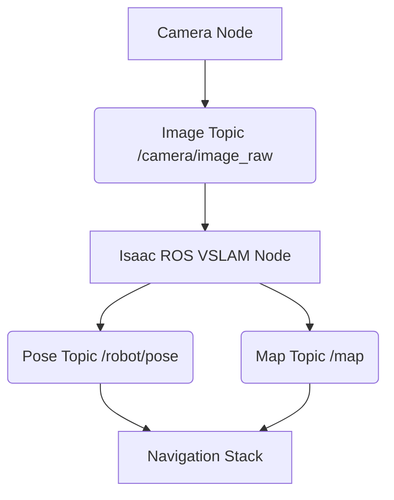

# Chapter 11: NVIDIA Isaac ROS and VSLAM

## Learning Objectives
- Understand the purpose and benefits of NVIDIA Isaac ROS.
- Learn how Isaac ROS modules accelerate robotics development.
- Grasp the fundamentals of Visual SLAM (Simultaneous Localization and Mapping).
- Explore how Isaac ROS VSLAM can be used for robust robot localization and mapping.

## Introduction
To truly unleash the power of AI in robotics, specialized software is needed to bridge the gap between high-level AI algorithms and low-level robot hardware. NVIDIA Isaac ROS is a collection of ROS 2 packages that leverages NVIDIA GPUs to accelerate perception and AI capabilities in robotics applications. This chapter delves into Isaac ROS, with a particular focus on Visual SLAM (VSLAM), a critical technology that enables robots to build maps of their environment while simultaneously tracking their own position within those maps.

## Core Concepts
### 1. What is NVIDIA Isaac ROS?
Isaac ROS is a set of hardware-accelerated ROS 2 packages designed to make it easier for roboticists to develop and deploy high-performance solutions. It provides optimized components for:
- **Perception**: Stereo depth, visual odometry, image processing.
- **AI**: Object detection, segmentation, pose estimation.
- **Navigation**: SLAM, path planning.

These packages leverage NVIDIA GPUs, significantly improving the performance of computationally intensive tasks compared to CPU-only implementations.

### 2. Visual SLAM (VSLAM) Fundamentals
VSLAM is the process of simultaneously constructing a map of an unknown environment and localizing the robot (determining its position and orientation) within that map using visual input (cameras). Key aspects include:
- **Feature Extraction**: Identifying salient points or features in images.
- **Data Association**: Matching features across different image frames.
- **State Estimation**: Estimating the robot's pose and map features.
- **Loop Closure**: Recognizing previously visited locations to correct accumulated errors.

### 3. Isaac ROS VSLAM
Isaac ROS offers highly optimized VSLAM modules that leverage GPU acceleration. These modules provide robust and accurate localization and mapping capabilities, crucial for autonomous navigation in complex and dynamic environments. By integrating with ROS 2, Isaac ROS VSLAM can be easily incorporated into your robot's perception pipeline.

## Hands-on Tutorial: Conceptual Isaac ROS VSLAM Pipeline

This conceptual tutorial outlines the data flow in an Isaac ROS VSLAM pipeline. (Requires Isaac ROS installation).

**Conceptual steps for using Isaac ROS VSLAM:**
1.  Start a camera node (simulated or real) publishing image data.
2.  Launch the Isaac ROS VSLAM node, subscribing to the camera image topics.
3.  The VSLAM node publishes the robot's estimated pose and a generated map.
4.  Other ROS 2 nodes (e.g., a navigation stack) can subscribe to this pose and map data.

## Key Takeaways
- NVIDIA Isaac ROS accelerates robotics AI tasks using GPUs.
- VSLAM enables simultaneous localization and mapping using cameras.
- Isaac ROS VSLAM provides high-performance, robust solutions for robot perception.
- It is a critical component for autonomous navigation in challenging environments.

## Exercises
1.  **Easy**: What is the primary benefit of using NVIDIA Isaac ROS in a robotics application?
2.  **Easy**: Briefly explain what VSLAM stands for and its main goal.
3.  **Medium**: Compare the advantages of visual sensors (e.g., cameras) for SLAM compared to laser-based sensors (LiDAR).
4.  **Medium**: Research and describe the "Bundle Adjustment" step in SLAM. Why is it important for accuracy?
5.  **Hard**: Outline a conceptual ROS 2 launch file that would start a simulated camera in Isaac Sim, an Isaac ROS VSLAM node, and RViz 2 to visualize the camera feed and the generated map. Specify the nodes, topics, and parameters you would consider.

---
_Bridge to next chapter: Accurate localization and mapping are foundational for robot autonomy. Building on VSLAM, the next chapter will explore advanced navigation techniques using Nav2, a powerful ROS 2 navigation framework that enables robots to plan paths and move intelligently in complex environments._
